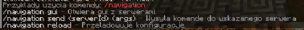
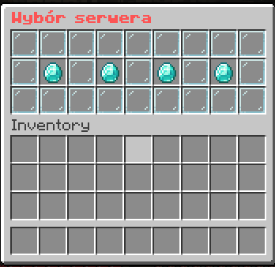
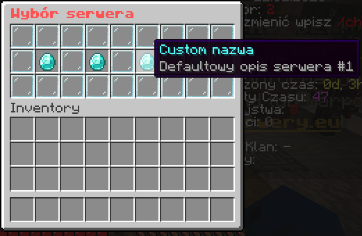
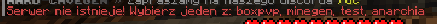
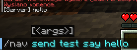
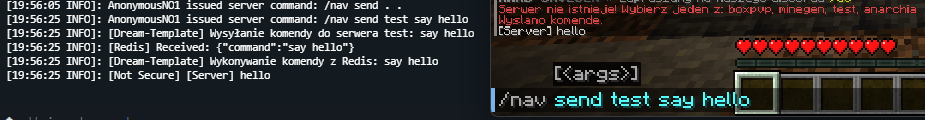
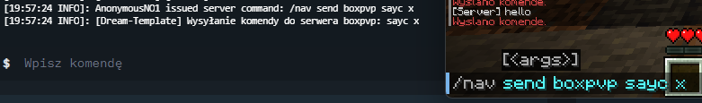

# Plugin nawigacji Minecraft 🚀

Ten plugin służy do nawigacji pomiędzy serwerami w sieci Goxy 🌐. Gracze mogą łatwo przemieszczać się pomiędzy serwerami
za pomocą GUI i wysyłać komendy (np. przez admina/konsole) do konkretnych serwerów przez Redis 🔧.

## Wymagania 🛠️

- **Plugin Goxy**: Wymaga zainstalowanego i skonfigurowanego pluginu Goxy z [goxy.io](https://goxy.io) ✅.
- **Redis**: Plugin używa Redis do wysyłania komend na serwery, więc upewnij się, że Redis jest poprawnie skonfigurowany
  w pliku konfiguracyjnym ⚙️.

## Funkcje ✨

- **/nav gui**: Otwiera GUI, w którym gracze mogą kliknąć na serwer, aby się na niego przenieść 🖱️.
- **Customowe Nazwy & Opisy Serwerów**: Możesz konfigurować nazwy i opisy serwerów w pliku konfiguracyjnym ⚙️.
- **Lista Serwerów do Ignorowania**: Możesz ustawić, które serwery mają być ukryte w GUI 🙈.
- **/nav send [id serwera] [komenda]**: Wysyła komendę na wskazany serwer za pomocą Redis 🔄.

## Instalacja i Konfiguracja ⚙️

1. **Zainstaluj Plugin Goxy**: Upewnij się, że Goxy jest zainstalowane i poprawnie skonfigurowane w Twojej sieci. Bez
   Goxy plugin nie będzie działał.
2. **Skonfiguruj Redis**: Dodaj ustawienia Redisa w pliku `config.yml`, aby włączyć wysyłanie komend.
3. **Skonfiguruj GUI**: Zmodyfikuj sekcję `gui-config` w pliku konfiguracyjnym, aby dostosować nazwy serwerów, opisy
   oraz serwery do ignorowania.

---

## Przykładowe Komendy 💻

- **/nav gui**: Otwiera GUI nawigacji, gdzie można wybrać serwer i się na niego przenieść 🏃‍♂️.
- **/nav send [id serwera] [komenda]**: Wysyła komendę na konkretny serwer 🖥️. Dodano opcje 'all'⚙️

---

## Przykładowy Plik Konfiguracyjny: `config.yml` 🔧

### Dream-Template (Main-Config)

```yml
# Debug pokazuje dodatkowe informacje do konsoli. Lepiej wylaczyc. :P
debug: true

redis-config:
  storage-type: REDIS
  prefix: dreamtemplate
  uri: ''
  login: default
  password: x

# Ustawienia menu z wyborem serwera
# Nazwa GUI
gui-config.name: '&c&lWybór serwera'
# Rozmiar GUI
gui-config.size: 3
# Serwery do ignorowania (według ID)
gui-config.ignore-servers:
  - hub
# Customowe nazwy serwerów i ich opisy
gui-config.custom-servers:
  - id: test
    name: '&bCustom nazwa'
    lore: '&7Defaultowy opis serwera #1'
```

## Obrazki















